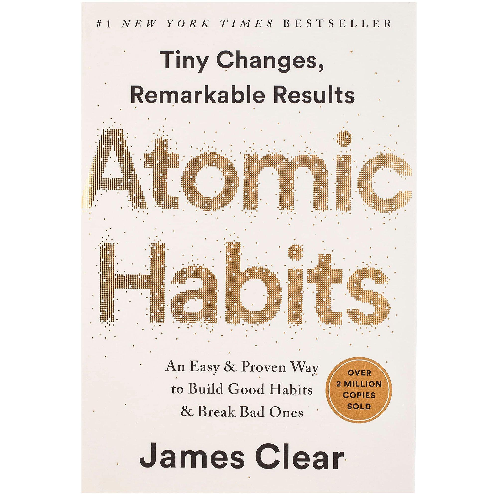
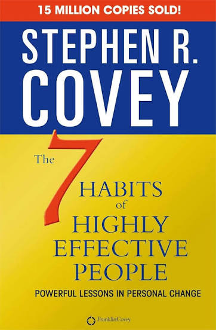
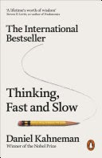
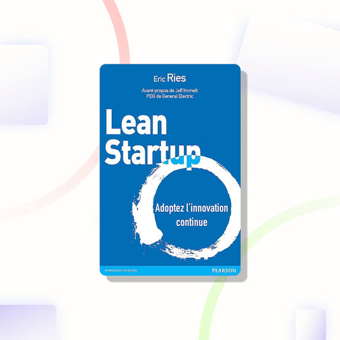
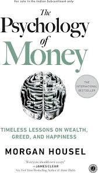
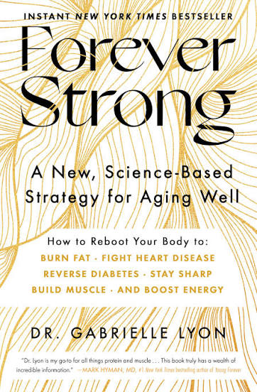

# Week 01 — Success Mindset (Mindset OS)

Part of the DevOps Micro Internship (DMI) with Agentic AI

---

## Purpose (Read This First)

This week is not motivation homework.

This is you building your **Mindset OS** — the system you will use for the next 5 months (and honestly, for years).

### Expectations

* Be honest.
* Be specific.
* Be practical.
* Write like an adult professional: clear sentences, no one-liners.

You will reuse this in later weeks. So do it properly once.

---

# Assignment 1. What is something you believe to be true that most people around you would disagree with?

### Rules

* No "safe" answers.
* Must be your real belief (not copied from internet).
* Minimum 50 words.

**Hint:** What do you believe about career, money, learning, discipline, relationships, health, success, life, tech industry, etc. that most people don't agree with?

## Answer

In my opinion career, money, learning, success, life all are connected with each other with a common characteristic called discipline and consistency. "Practice makes man perfect" this line is not just a normal quote, it realy has weights on every word. Practice, hard work, honesty and faith towards self drags a human to the success. The most precious jewel of a human is their health, it may be physical or mental both have to maintained neatly to reach a destination they want to reach. Human beings are social animals. All they want a relationship to live. A healthy relation always pushes a person toward success. People do not care all these necessities together and fails to maintain them simultaneously with efficiency. Here they choke in their path towards success. 

---

# Assignment 2. What are the top 3 objective truths you discovered through experimentation and results?

### Definition

Objective truths do not depend on opinions. They hold true regardless of how people feel.

Write each truth in this format:

**Truth:** (1 sentence)

**Evidence from my life:** (2–4 lines: what you tried + what happened)

---

## Truth #1

### Truth

Time waits for no one. It always flew away.

### Evidence from my life

If i let an deal go, some one grab it and i will never ever get that in future. 

---

## Truth #2

### Truth

Only hard work can get every job done.

### Evidence from my life

If I study hard and prepare my self very well, then I wil get a good job.

---

## Truth #3

### Truth

History is the ultimate teacher.

### Evidence from my life

If I do not learn from my faults from past, I will never able to progress in the life. Every day brings a brand new start. So try to correct yesterday's mistakes makes me bulid more experience in my work life. 

---

# Assignment 3. What does your 2.0 version look like?

### Instructions

Write as if a journalist is writing about you **3 to 7 years from now** (not 20 years).

**Minimum 300 words.**

### Rules

* Write in past tense, like it already happened.
* Don't use "likes to / wants to / hopes to."
* Use specifics:

  * built
  * shipped
  * led
  * published
  * earned
  * relocated
  * contributed
* Include skills proof:

  * projects
  * portfolios
  * GitHub
  * blogs
  * certifications
  * job role
  * leadership
  * community contribution
* Add 1–3 images if you can (optional but powerful).

### Publish It Publicly On Any ONE

* LinkedIn
* Medium
* WordPress
* Blogspot
* Personal blog
* Portfolio page

Use the credit note that matches your track:

Add the following credit note at the end of your post **(If you are DMI Cohort 3 student)**:

> **P.S. This post is part of the DevOps Micro Internship (DMI) with Agentic AI — Cohort 3 — by [Pravin Mishra](https://www.linkedin.com/in/pravin-mishra-aws-trainer/). My graded progress is public: https://dmi.pravinmishra.com/s/YOUR-GITHUB-USERNAME.html · Start your DevOps journey: https://dmi.pravinmishra.com/?utm_source=student&utm_medium=ps-blog&utm_campaign=cohort3**

**Tag [Pravin Mishra](https://www.linkedin.com/in/pravin-mishra-aws-trainer/) in your LinkedIn post, then tag Lead Co-Mentor — [Anjana Muthunayake](https://www.linkedin.com/in/anjana-muthunayake/).**

Add the following credit note at the end of your post **(If you are DMI Self-paced track student)**:

> **P.S. This post is part of the DevOps Micro Internship (DMI) — Self-Paced Engineer Track — by [Pravin Mishra](https://www.linkedin.com/in/pravin-mishra-aws-trainer/). My graded progress is public: https://dmi.pravinmishra.com/s/YOUR-GITHUB-USERNAME.html · Start your DevOps journey: https://dmi.pravinmishra.com/?utm_source=student&utm_medium=ps-blog&utm_campaign=self-paced**

Add the following credit note at the end of your post **(If you are DMI Campus student)**:

> **P.S. This post is part of the DevOps Micro Internship (DMI) — Campus — by [Pravin Mishra](https://www.linkedin.com/in/pravin-mishra-aws-trainer/). My graded progress is public: https://dmi.pravinmishra.com/s/YOUR-GITHUB-USERNAME.html · Start your DevOps journey: https://dmi.pravinmishra.com/?utm_source=student&utm_medium=ps-blog&utm_campaign=campus**

**Tag [Pravin Mishra](https://www.linkedin.com/in/pravin-mishra-aws-trainer/) in your LinkedIn post, then tag Lead Co-Mentor — [Anjana Muthunayake](https://www.linkedin.com/in/anjana-muthunayake/).**

Hashtags:

#DMIByPravinMishra #AgenticAI #DevOps

## Your Article

What Does My 2.0 Version Look Like?

  If someone wrote about me a few years from now, I don’t think the story would be about one huge achievement. It would probably be about all the small things I did consistently that eventually changed where I ended up.

By 2031, I wish, I had become much more confident in my skills and in the android industry I could do. I had built several projects that were more than just assignments. I had taken ideas, worked through the problems, made mistakes, fixed them, that I could proudly show to other people.

My GitHub had also changed a lot. It was no longer just a place where I uploaded code for college work. It had become a record of my learning — projects, experiments, improvements, and things I had built from scratch. My portfolio could show more than now. Instead of saying that I knew certain technologies, I had real work to prove it.

I had also started writing about what I learned. I published blogs and project explanations, especially about things that had confused me when I was learning them. Writing helped me understand my own knowledge better, and it also gave me a way to help someone who was just starting out.

One of the biggest changes was that I had also started taking leadership more seriously. I had helped juniors and classmates, participated in technical communities, and contributed wherever I could. I learned that leadership was not always about having a title. Sometimes it was simply being the person who stepped forward when something needed to be done.

Looking back, my 2.0 version was not perfect. I still made mistakes. I still had things to learn. But I had become more disciplined and much clearer about where I was going.

The biggest difference was that I had stopped thinking only about what I wanted to achieve someday and started focusing on what I could build and contribute today.

My 2.0 version was simply a better, more experienced version of me — someone who had turned learning into projects, projects into opportunities, and opportunities into real growth.

All thanks to DMI campus by Pravin Mishra makes me realize this.

#DMIByPravinMishra #AgenticAI #DevOps 

P.S. This post is part of the DevOps Micro Internship (DMI) — Self-Paced Engineer Track — by [Pravin Mishra](https://www.linkedin.com/in/pravin-mishra-aws-trainer/). My graded progress is public: https://dmi.pravinmishra.com/s/sayan-k.html · Start your DevOps journey: https://dmi.pravinmishra.com/?utm_source=student&utm_medium=ps-blog&utm_campaign=self-paced

### Public Link

Paste your link here:

https://www.linkedin.com/posts/sayan-koley-819aa3329_dmi-devops-micro-internship-with-agentic-activity-7505325187123351553-VP4P?utm_source=share&utm_medium=member_desktop&rcm=ACoAAFLrytUBKAINNScXy4_MPRWNHzV9CRwB3UM

---

# Assignment 4. Have you ever cut corners (unethical / dishonest / shortcut behavior — not necessarily illegal)? If yes, how did it make you feel?

### Important

You don't need to write the full story.

Focus on the feeling:

* guilt
* fear
* shame
* stress
* regret
* numbness
* etc.

This is about self-awareness, not judgment.

### Answer Format

**Yes / No**

If Yes:

**What emotion did you feel?** (minimum 50–100 words)

## Answer

Yes.

I greatly feel guilt when I copy my assignments from others given by teachers in college. In those time it feels more like achiver cause I can finish my assignment before other would have. Now, I am regretting over this for failing to grow my knowledge from that assignments.

---

# Assignment 5. What are 10 non-fiction books you plan to read in the next 1 year?

### Rules

* Mention **Title + Author**
* Any language allowed
* No fiction novels

### Tip

Choose books that improve:

* mindset
* communication
* productivity
* health
* money
* career
* leadership

## Book List

1. Atomic Habits — James Clear

2. Deep Work — Cal Newport

3. The 7 Habits of Highly Effective People — Stephen R. Covey

4. Ikigai — Héctor García and Francesc Miralles

5. Thinking, Fast and Slow - Daniel Kahneman

6. The Lean Startup — Eric Ries

7. Can't Hurt Me — David Goggins

8. The Psychology of Money — Morgan Housel

9. Forever Strong: A New, Science-Based Strategy for Aging Well - Gabrielle Lyon

10. Talk Like TED - Carmine Gallo

---

# Assignment 6. What are the things you will measure regularly in your life and career?

### Rules

List topics only. No need to share numbers.

### Must Include

* Learning / skill
* Output / proof
* Health / energy
* Time / focus
* Money / finance (personal or business)

### Example

* Learning hours per week
* Deep work sessions per week
* Projects shipped / documented
* Steps / workouts
* Sleep hours
* Spending tracker

## My Metrics

* Learn a skill and polish it with practice.
* Personal skill development (communication skills , knowledge base)
* Creating new project plans in Android , if one is already there build it, review it and perfect it. 
* Social medis community maintanence.
* Get a good sleep at onec in a day atleast 6 hrs.
* Play some outdoor games or online games for stress relif.

---

# Assignment 7. Brain Dump + 5-Month System Plan

## Step 1: Brain Dump (Private)

Do a brain dump of everything in your mind into a notebook.

Examples:

* Bills
* Tasks
* Worries
* Goals
* Pending messages
* Ideas
* Responsibilities

### Did You Do It?

**Yes / No**

Answer:

Yes

---

## Step 2: Your 5-Month Routine + Focus Blocks

Create a simple plan you can realistically follow for the next 5 months.

### Weekly Routine

Example:

* Mon–Thu: 60 min deep work
* Sat: DMI session
* Sun: Weekly review

#### My Weekly Routine

Monday–Thursday: 120 min deep work

7:00–9:00 PM

Focus on one primary technical track at a time:

Android development

Rule: Build > Review > Proced to next.
Watch some tutorial and build according to the design plan, then review it and proced to the next.

Saturday: 30–45 min — Job preparation

2:00–3:45 PM

Alternate between:

Apptitude practice.
Verbal communication.
Reading aloud books.

The goal is to become someone who can explain engineering clearly, not just do it.

Sunday: 1.5–2 hr — DMI + Project

Flexible, preferably afternoon/evening

1 hr: DMI work
30–60 min: Apply what you learned to your own project.

Don't let DMI become something you complete only for the certificate. Extract something useful from every session and put it into your actual engineering work.

Sunday: 6:00-8:00 PM - community handles

Linkedin posts, github protfolio update.

Sunday: 30 min — Weekly Review

---

### Focus Blocks

#### When Will You Do DMI Work? (Days + Time)

Everyday 2hr for the course work and one weekly live session on Thrusday.

#### How Many Sessions Per Week?

One live session and atleast 12 recorded sessions. 

---

### Distraction Rules

Examples:

* Phone rules
* Social media rules
* Environment setup

#### My Distraction Rules

* Discipline: Prioritize long-term goals and complete one before going to the next.
* Accountability: Review my daily achievments at the end of each day and plan for tomorrow.
* Entertainment: Reserve movies, Gaming for scheduled rest periods.
* Social Media: Use social media only for learning, networking or publishing content.
---

# Reflection – Week 1

### Biggest insight I got about myself this week

The big problem in my life is not the plan or the time the problem is to execute it. I always look for a shortcut or an easy way to do a job fast. But, it ultimately slows me down to achieve my final goal.

### My biggest weakness/loop I noticed

I foresee the result without even starting the work and later get disapointed. And I just do the planning part not the hard job to execut it. 

### One system I will implement from this week (exact habit + time)

Not just thinking, executing the plans.

### LinkedIn Post

Paste your LinkedIn post link here.

`https://www.linkedin.com/posts/sayan-koley-819aa3329_dmi-devops-micro-internship-with-agentic-activity-7505556299397382144-G1qw?utm_source=share&utm_medium=member_desktop&rcm=ACoAAFLrytUBKAINNScXy4_MPRWNHzV9CRwB3UM`

---

## 10. Proof of Work

- LinkedIn Post URL: [**Sayan Koley linkedin**  ](https://www.linkedin.com/posts/sayan-koley-819aa3329_dmi-devops-micro-internship-with-agentic-activity-7505556299397382144-G1qw?utm_source=share&utm_medium=member_desktop&rcm=ACoAAFLrytUBKAINNScXy4_MPRWNHzV9CRwB3UM)
- Blog / Medium : [**Sayan Koley Blog**](https://medium.com/@sayankoley3456/i-am-learning-to-stop-planning-and-start-doing-9213beb0c19a)  

---

## 📌 About DMI & CloudAdvisory

DevOps Micro Internship (DMI) is a project-based DevOps program run by Pravin Mishra (The CloudAdvisory) focused on real-world execution, systems thinking, and career readiness.

It helps learners build strong DevOps foundations with hands-on experience.

## 📌 Resources

- 🌐 **DMI Official Website:** https://dmi.pravinmishra.com?utm_source=github&utm_medium=readme  
- 🎓 **University:** https://university.pravinmishra.com?utm_source=github&utm_medium=readme  
- 💬 **Discord Community:** https://discord.pravinmishra.com?utm_source=github&utm_medium=readme  
- 📝 **Blog:** https://dmi.pravinmishra.com/blog?utm_source=github&utm_medium=readme  
- ▶️ **YouTube Playlist (DMI Cohort 3):** https://www.youtube.com/playlist?list=PLFeSNDtI4Cho  
- 🔗 **Pravin Mishra (LinkedIn):** https://www.linkedin.com/in/pravin-mishra-aws-trainer/  
- 🏢 **CloudAdvisory (LinkedIn):** https://www.linkedin.com/company/thecloudadvisory/

---

*This submission is part of DevOps Micro Internship (DMI) — Agentic AI Track*