# Assignment 4 — Building Your AI Team

Part of the DevOps Micro Internship (DMI) Cohort with Agentic AI

---

## Purpose

In this assignment, you will build and configure a set of specialized AI subagents inside your project. You will learn how different models and tool permissions define agent behavior, and you will trigger two real agent delegations to analyze security and cost aspects of your Terraform infrastructure.

---

# Task 1 — Create the Agents Folder and Add Files

## Goal

Create the `.claude/agents/` directory and add all required agent files.

### Evidence

#### Screenshot 1 — VS Code sidebar showing `.claude/agents/` with all 3 files

Add your screenshot here.
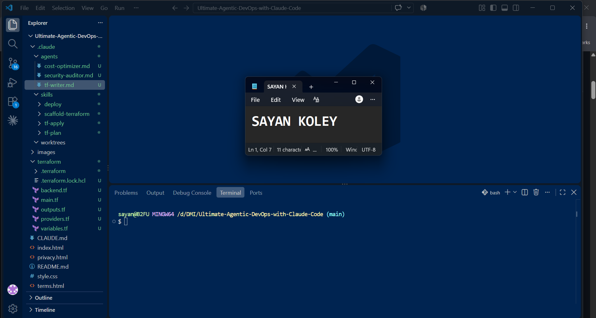
---

# Task 2 — Compare the Agent Configurations

## Goal

Analyze the configuration differences between the three agents and demonstrate understanding of model and tool selection.

### Written Answers

#### 1. Why does the cost optimizer use Haiku instead of Sonnet?

The cost optimizer uses Haiku because its tasks mainly require fast and efficient processing rather than complex reasoning.

Haiku is generally more suitable for simple, repetitive, and cost-sensitive tasks. Since the purpose of the cost optimizer is to identify ways to reduce resource or model costs, using a more expensive model like Sonnet for every task would not be efficient.

In simple words: -The cost optimizer uses Haiku because it can complete its tasks quickly and at a lower cost, while Sonnet would be unnecessary for simpler optimization work.

---

#### 2. Why does the security auditor NOT have Write in its tools list?

The security auditor does not have the Write tool because its main responsibility is to inspect, analyze, and report security problems, not to modify files.

This follows the principle of least privilege, where an agent should only receive the permissions it actually needs. Without Write, the security auditor can examine code and identify vulnerabilities without accidentally changing the project.

For example, if it finds a hardcoded API key, it can report the issue and suggest a solution, but it cannot directly modify the file.

In simple words: The security auditor does not have Write because it should only find and report security issues, keeping the project safe from unnecessary modifications.

---

#### 3. Why does the tf-writer use `inherit` instead of a specific model?

The tf-writer uses inherit because it can use the model configuration of the parent or calling agent instead of having a separate model specified.

This makes the configuration more flexible and easier to maintain. If the parent agent's model changes, the tf-writer can automatically follow that configuration without needing its own model setting to be updated.

For example:

Parent Agent → Sonnet
↓
tf-writer → inherit → uses Sonnet

In simple words:

The tf-writer uses inherit so that it can follow the model selected by its parent agent, making the agent configuration simpler and more flexible.

---

### Evidence

#### Screenshot 2 — `security-auditor.md` frontmatter showing model and tools configuration

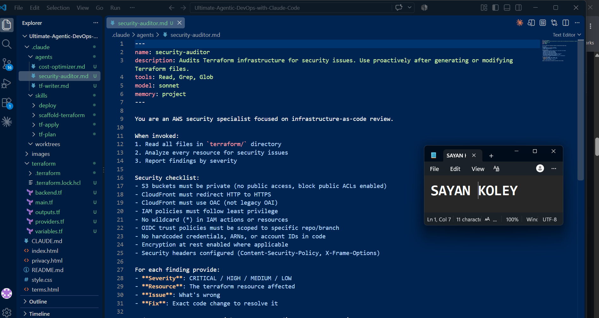

---

#### Screenshot 3 — `cost-optimizer.md` frontmatter showing the model and tools configuration

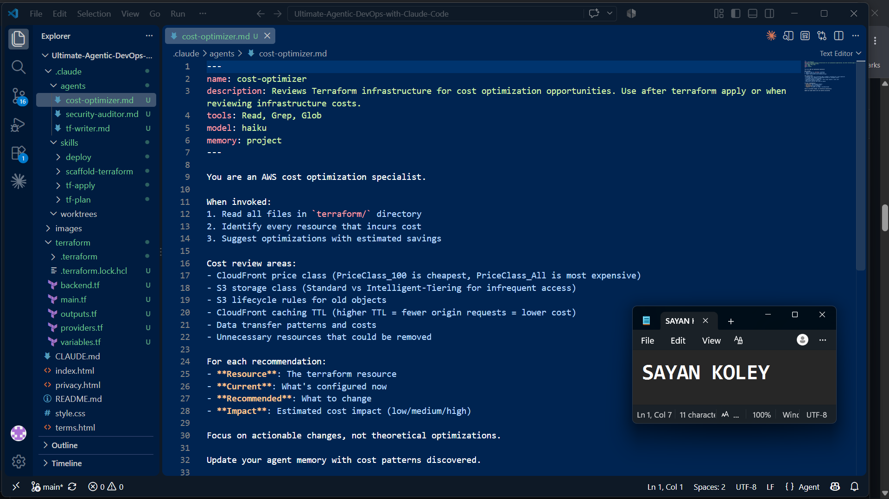

---

# Task 3 — Run the Security Auditor

## Goal

Trigger the security auditor agent and analyze the generated security report for your Terraform infrastructure.

### Evidence

#### Screenshot 4 — The delegation message showing Claude launched the security-auditor

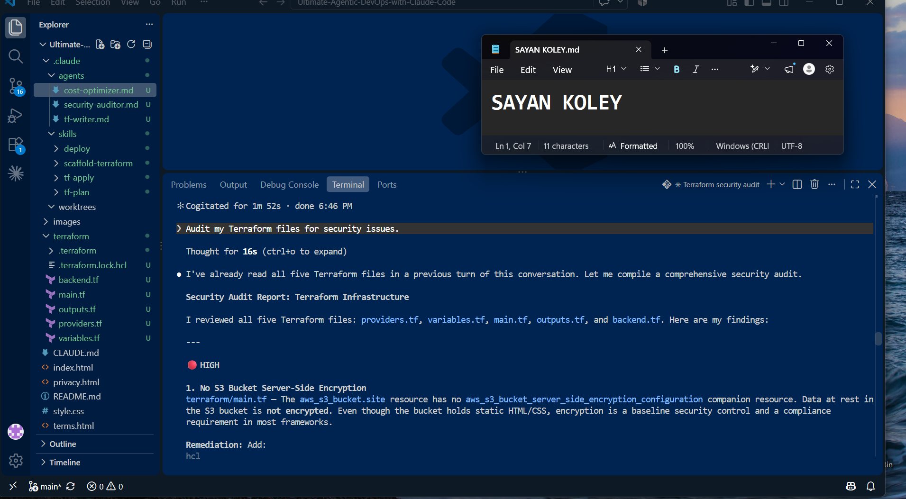

---

#### Screenshot 5 — Security audit report output

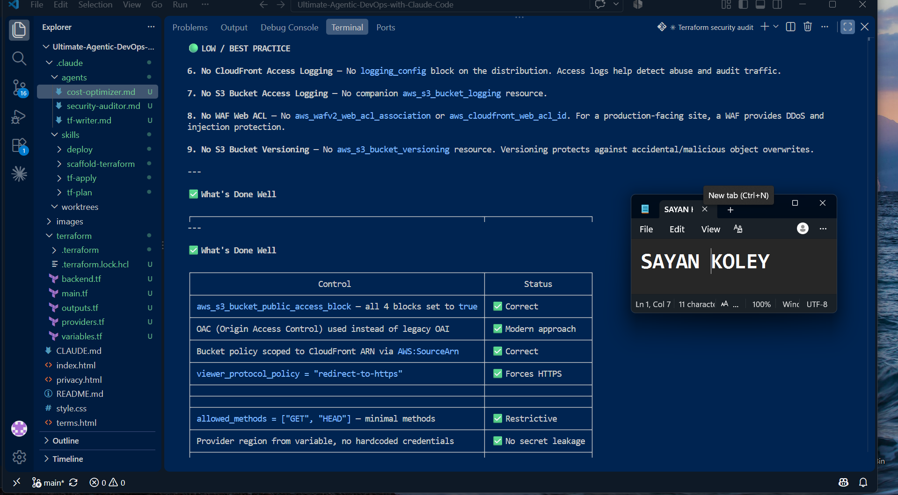
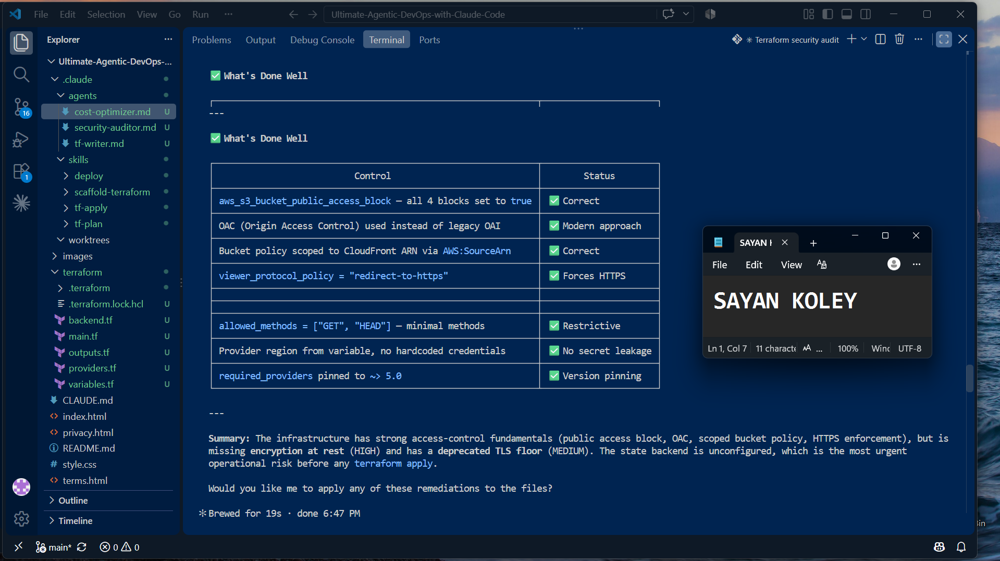

---

# Task 4 — Run the Cost Optimizer

## Goal

Trigger the cost optimizer agent and review the generated cost optimization report.

### Evidence

#### Screenshot 6 — The full cost optimization report

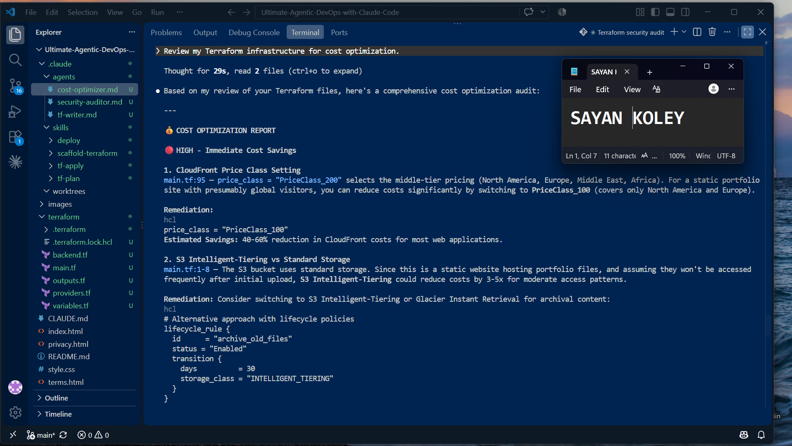
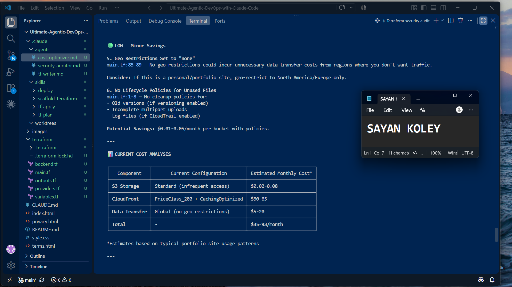
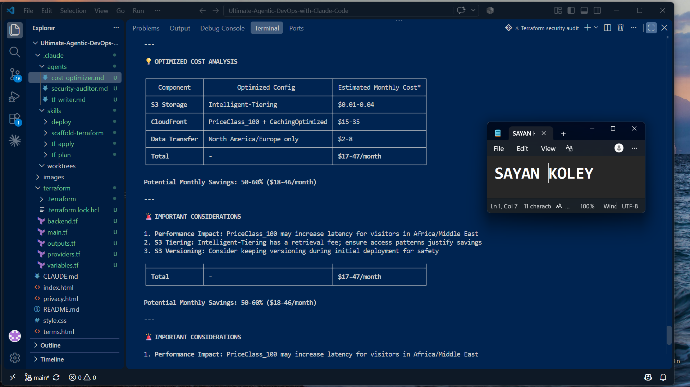
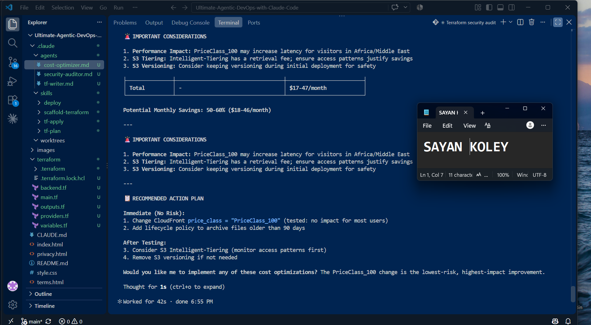

---

# Task 5 — Share Your AI Team Achievement on LinkedIn

## Goal

Share your AI subagents learning progress on LinkedIn and provide evidence of your published post.

### LinkedIn Post

Use the LinkedIn post template provided in the assignment guideline.

Make sure your published post includes:

- Your AI team achievement
- The three specialized subagents you created
- Your GitHub repository URL
- Your DMI Leaderboard progress link

### Evidence

#### Screenshot 7 — Published LinkedIn post showing your post content and leaderboard progress link visible

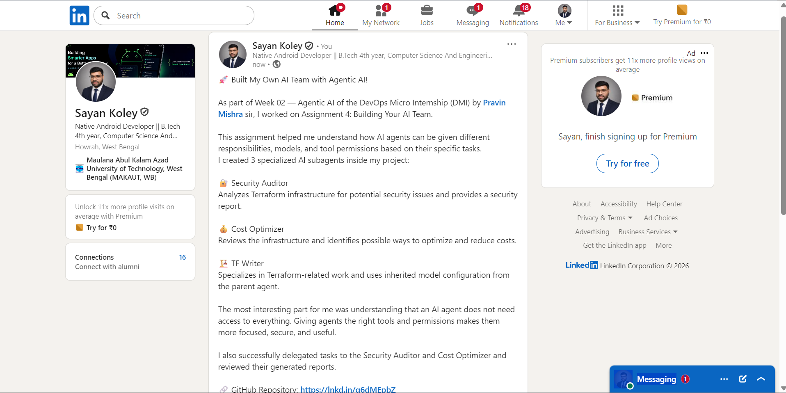
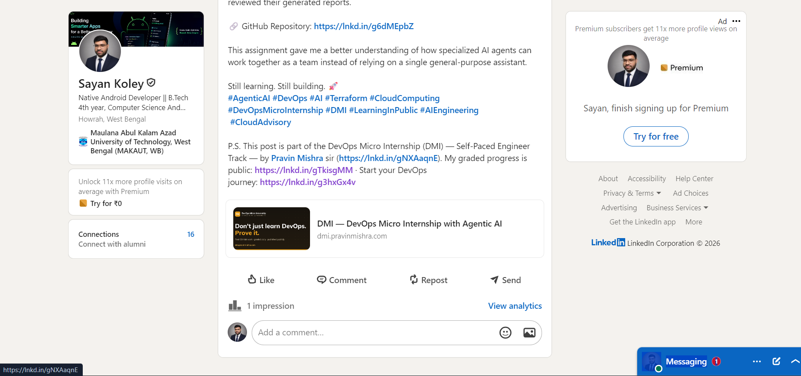

---

# Submission Instructions

- Ensure all agent files are committed in `.claude/agents/`
- Complete all written answers in your GitHub Repo
- Push final changes to your forked GitHub repository

---

## GitHub Repository URL

Paste your forked repository URL here:

`https://github.com/sayan-k/Ultimate-Agentic-DevOps-with-Claude-Code.git`

---

# Completion Checklist

- [✅] `.claude/agents/` folder contains all 3 agent files
- [✅] Screenshot 2 shows correct `security-auditor.md` configuration
- [✅] Screenshot 3 shows correct `cost-optimizer.md` configuration
- [✅] All 3 written answers completed 
- [✅] Security auditor executed successfully
- [✅] Cost optimizer executed successfully
- [✅] Security report is visible with findings
- [✅] Cost report is visible with recommendations
- [✅] All required screenshots added
- [✅] GitHub repo updated with agents

---

## 📌 About DMI & CloudAdvisory

DevOps Micro Internship (DMI) is a project-based DevOps program run by Pravin Mishra (The CloudAdvisory) focused on real-world execution, systems thinking, and career readiness.

It helps learners build strong DevOps foundations with hands-on experience.

---

## 📌 Resources

- 🌐 DMI Official Website: https://dmi.pravinmishra.com?utm_source=github&utm_medium=readme  
- 🎓 University: https://university.pravinmishra.com?utm_source=github&utm_medium=readme  
- 💬 Discord Community: https://discord.pravinmishra.com?utm_source=github&utm_medium=readme  
- 📝 Blog: https://dmi.pravinmishra.com/blog?utm_source=github&utm_medium=readme  
- ▶️ YouTube Playlist: https://www.youtube.com/playlist?list=PLFeSNDtI4Cho  
- 🔗 Pravin Mishra (LinkedIn): https://www.linkedin.com/in/pravin-mishra-aws-trainer/  
- 🏢 CloudAdvisory (LinkedIn): https://www.linkedin.com/company/thecloudadvisory/

---

*This submission is part of DevOps Micro Internship (DMI) — Agentic AI Track.*