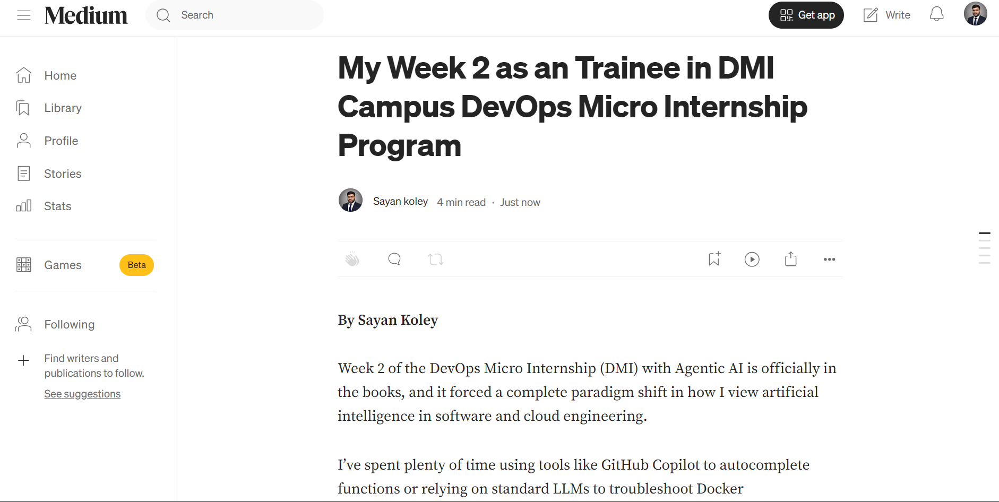
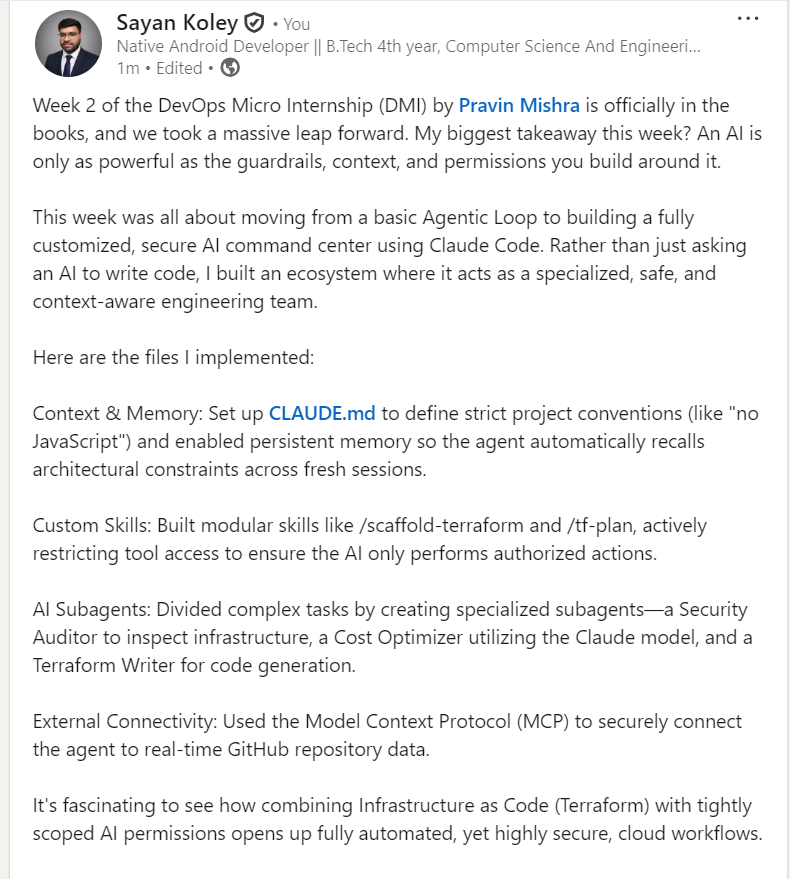
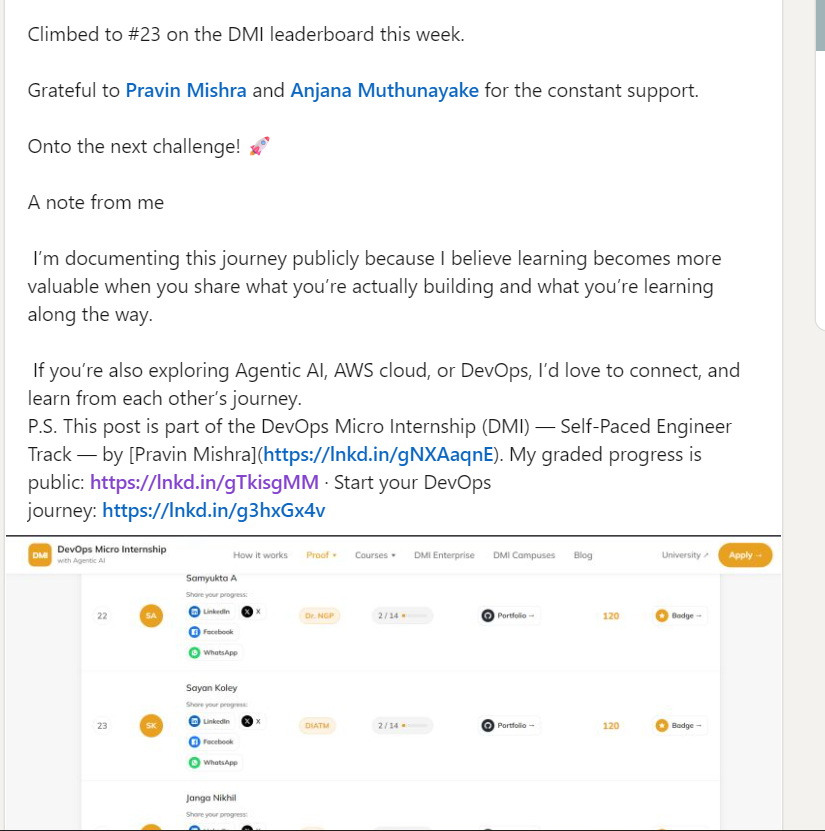

# Assignment 8 — Week 2 Reflection Blog

Part of the DevOps Micro Internship (DMI) with Agentic AI

---

# Purpose

In this assignment, you will reflect on your Week 2 learning journey and write a short blog capturing your experience working with Agentic AI tools such as Claude Code, Skills, Subagents, MCP, Hooks, Permissions, and Memory.

You will also publish a LinkedIn post summarizing your learning and share both links for evaluation.

---

# Task 1 — Write Your Reflection Blog

## Goal

Write a reflection blog covering your Week 2 learning experience.

### Blog Requirements

Your blog must include:

* Title: **Reflection – Week 2**
* Minimum 300 words
* At least 2–3 topics from Week 2 (Claude Code, Skills, Subagents, MCP, Hooks, Permissions, Memory)
* Honest personal reflection (learning, challenges, mindset)
* One habit/system you plan to implement
* Your full name clearly visible

### Allowed Platforms

You can publish your blog on:

* Hashnode
* Medium
* Dev.to
* LinkedIn Article
* GitHub Markdown file
* Substack

---

### Evidence

#### Screenshot 1 — Blog published and visible



---

### Submission Field

Blog Link:

`https://medium.com/@sayankoley3456/my-week-2-as-an-trainee-in-dmi-campus-devops-micro-internship-program-8b61799e5e6e`

---

# Task 2 — Create LinkedIn Post

## Goal

Share your Week 2 learning publicly on LinkedIn.

---

### Evidence

#### Screenshot 2 — LinkedIn post published




---

### Submission Field

LinkedIn Post Content (copy-paste here):

```
Week 2 of the DevOps Micro Internship (DMI) by Pravin Mishra is officially in the books, and we took a massive leap forward. My biggest takeaway this week? An AI is only as powerful as the guardrails, context, and permissions you build around it. 
 
This week was all about moving from a basic Agentic Loop to building a fully customized, secure AI command center using Claude Code. Rather than just asking an AI to write code, I built an ecosystem where it acts as a specialized, safe, and context-aware engineering team. 

Here are the files I implemented:

Context & Memory: Set up CLAUDE.md to define strict project conventions (like "no JavaScript") and enabled persistent memory so the agent automatically recalls architectural constraints across fresh sessions. 

Custom Skills: Built modular skills like /scaffold-terraform and /tf-plan, actively restricting tool access to ensure the AI only performs authorized actions. 

AI Subagents: Divided complex tasks by creating specialized subagents—a Security Auditor to inspect infrastructure, a Cost Optimizer utilizing the Claude model, and a Terraform Writer for code generation.
 
External Connectivity: Used the Model Context Protocol (MCP) to securely connect the agent to real-time GitHub repository data. 

It's fascinating to see how combining Infrastructure as Code (Terraform) with tightly scoped AI permissions opens up fully automated, yet highly secure, cloud workflows.

Climbed to #23 on the DMI leaderboard this week.

Grateful to Pravin Mishra and Anjana Muthunayake for the constant support.

Onto the next challenge! 🚀

A note from me

 I’m documenting this journey publicly because I believe learning becomes more valuable when you share what you’re actually building and what you’re learning along the way.

 If you’re also exploring Agentic AI, AWS cloud, or DevOps, I’d love to connect, and learn from each other’s journey. 
P.S. This post is part of the DevOps Micro Internship (DMI) — Self-Paced Engineer Track — by [Pravin Mishra](https://lnkd.in/gNXAaqnE). My graded progress is public: https://lnkd.in/gTkisgMM · Start your DevOps journey: https://lnkd.in/g3hxGx4v
```

---

### LinkedIn Post Link:

`https://www.linkedin.com/posts/sayan-koley-819aa3329_week-2-of-the-devops-micro-internship-dmi-activity-7506714400557338624-TxhR?utm_source=share&utm_medium=member_desktop&rcm=ACoAAFLrytUBKAINNScXy4_MPRWNHzV9CRwB3UM`

---

# Submission Instructions

* Blog must be publicly accessible
* LinkedIn post must be visible (public or unlisted where applicable)
* All required fields must be filled
* Screenshot proofs must be added to GitHub repository
* Do not include sensitive information in blog or post

---

# Completion Checklist

* [✅] Blog written with required structure
* [✅] Blog includes at least 2–3 Week 2 topics
* [✅] Blog is publicly accessible
* [✅] LinkedIn post created
* [✅] Required P.S. line included
* [✅] LinkedIn post content copied in submission field
* [✅] Blog link added
* [✅] LinkedIn post link added
* [✅] Screenshots added to GitHub repo

---

# About DMI & CloudAdvisory

DevOps Micro Internship (DMI) is a project-based DevOps program run by Pravin Mishra (The CloudAdvisory), focused on real-world execution, systems thinking, and agentic AI workflows.

It helps learners build strong DevOps foundations through hands-on experience.

---

# Resources

* 🌐 DMI Official Website: [https://dmi.pravinmishra.com?utm_source=github&utm_medium=readme](https://dmi.pravinmishra.com?utm_source=github&utm_medium=readme)
* 🎓 University: [https://university.pravinmishra.com?utm_source=github&utm_medium=readme](https://university.pravinmishra.com?utm_source=github&utm_medium=readme)
* 💬 Discord Community: [https://discord.pravinmishra.com?utm_source=github&utm_medium=readme](https://discord.pravinmishra.com?utm_source=github&utm_medium=readme)
* 📝 Blog: [https://dmi.pravinmishra.com/blog?utm_source=github&utm_medium=readme](https://dmi.pravinmishra.com/blog?utm_source=github&utm_medium=readme)
* ▶️ YouTube Playlist: [https://www.youtube.com/playlist?list=PLFeSNDtI4Cho](https://www.youtube.com/playlist?list=PLFeSNDtI4Cho)
* 🔗 Pravin Mishra (LinkedIn): [https://www.linkedin.com/in/pravin-mishra-aws-trainer/](https://www.linkedin.com/in/pravin-mishra-aws-trainer/)
* 🏢 CloudAdvisory (LinkedIn): [https://www.linkedin.com/company/thecloudadvisory/](https://www.linkedin.com/company/thecloudadvisory/)
---

*This submission is part of DevOps Micro Internship (DMI) — Agentic AI Track.*
